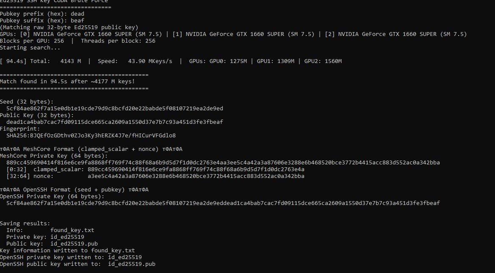

<div align="center">

# 🚀 GPU Ed25519 Vanity Generator

### CUDA accelerated Ed25519 public key and fingerprint vanity search

Search custom prefixes and suffixes in:

🔑 Ed25519 Public Keys
🔍 SHA256 SSH Fingerprints

Multi-GPU support.

</div>

---

## ✨ Features

* ⚡ CUDA accelerated
* 🖥 Multi-GPU support
* 🎯 Public key prefix matching
* 🎯 Public key suffix matching
* 🔍 SSH fingerprint matching
* 🔐 OpenSSH key export
* 📡 MeshCore compatible export

---

## 📖 Usage

```bash
ed25519brute_cuda.exe --fingerprint-prefix dead
ed25519brute_cuda.exe --fingerprint-suffix beef
ed25519brute_cuda.exe --fingerprint-prefix dead -suffix beef -blocks 256 -gpu 0,1
```
---
## 📚 Build Instructions

- 🇺🇸 [English Build Guide](BUILD_INSTRUCTIONS_EN.md)
- 🇷🇺 [Русская инструкция по сборке](BUILD_INSTRUCTIONS_RU.md)

---

## ⚙ Parameters

| Option                 | Description         |
| ---------------------- | ------------------- |
| `--fingerprint-prefix` | Fingerprint prefix  |
| `--fingerprint-suffix` | Fingerprint suffix  |
| `--pubkey-prefix`      | Public key prefix   |
| `--pubkey-suffix`      | Public key suffix   |
| `--blocks`             | CUDA blocks per GPU |
| `--gpu`                | GPU IDs             |

---

## 📸 Example Search



---

---

## 🙏 Credits

Math inspiration:

https://github.com/4equest

CUDA implementation and full project:

https://github.com/c0baca

---

## ☕ Donation

### Bitcoin

```text
1LGsYVdf4uEQn6qvuC145Nu1AgZ3via6wE
```

---

<div align="center">

⭐ If you find this project useful, consider giving it a star ⭐

</div>
